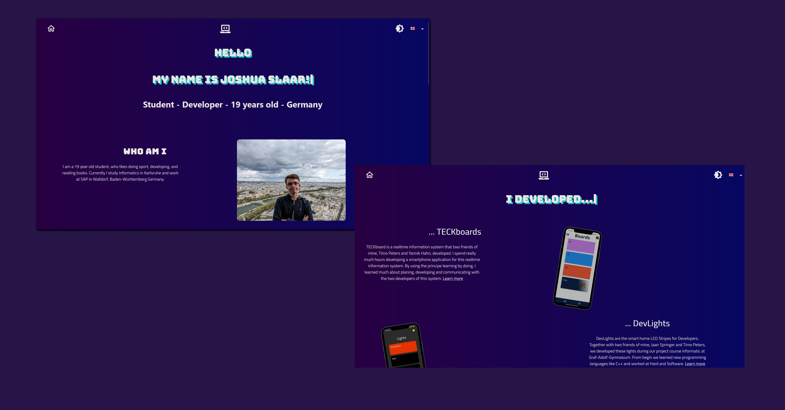

# My Website 

  

Welcome to the repository of my personal website, available at [https://joshua.slaar.de](https://joshua.slaar.de). This website serves as my online portfolio and is a showcase of my projects and skills.

## Built With

The website is built using the following technologies:

- [Create React App](https://create-react-app.dev/)
- [TypeScript](https://www.typescriptlang.org/)
- [Material UI](https://material-ui.com/)

## Availability

As of 25th June 2023, the website is live and accessible under https://joshua.slaar.de.

## Feedback

I appreciate any feedback or suggestions. If you have something to share, please feel free to send me an [email](mailto:joshu@slaar.de).
